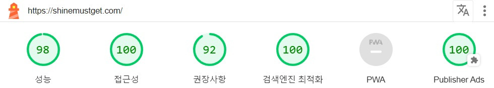

# Shine Must Get

- [Shine Must Get](#shine-must-get)
  - [프로젝트 소개](#프로젝트-소개)
  - [프로젝트 결과물](#프로젝트-결과물)
  - [아키텍쳐](#아키텍쳐)
  - [웹 성능](#웹-성능)
    - [검색 엔진 최상단 노출](#검색-엔진-최상단-노출)

## 프로젝트 소개

Shine Must Get은 목표 달성을 위한 만다라트를 쉽게 작성하고 관리할 수 있도록 도와주는 서비스입니다. 만다라트 작성을 위해 OpenAI의 ChatGPT를 활용하여 자연어로 작성된 목표를 인식하고 해당 목표를 달성하기 위해 필요한 중간 목표와 세부 목표를 제공해줍니다.

## 프로젝트 결과물

## 아키텍쳐

## 웹 성능

### 검색 엔진 최상단 노출

