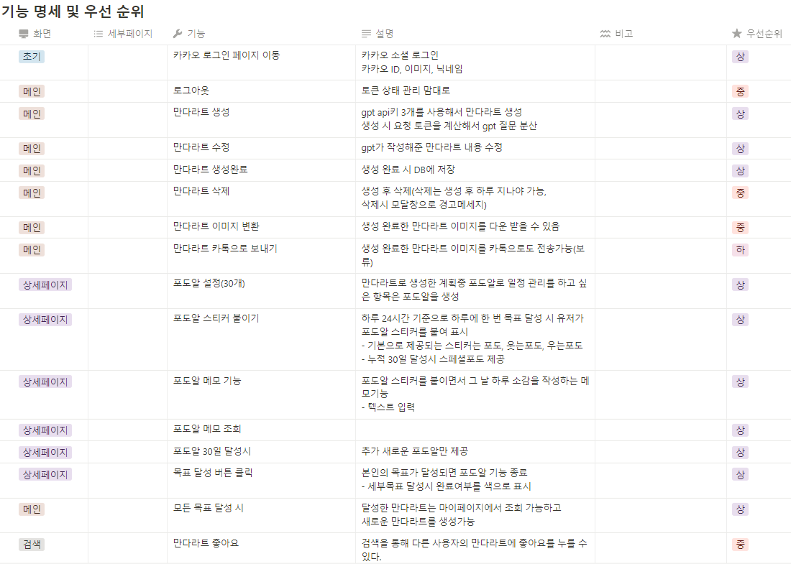

# 1. SHINE MUST GET 소개

### ** 목표 달성을 위한 만다라트 제작 서비스 SHINE MUST GET **

🌵 Naming : 실행해야 되는 목표, SHINE을 반드시 얻는다는 의미의 MUST GET

| 81개의 목표를 설정하고 꾸준이 달성하기 어려운 사람을 위해 ChatGPT를 이용해 만다라트를 자동으로 제작해주는 서비스

# 2. 🔍 개발 환경

## 2-1. 환경 설정

### **👨‍💻 Front-end**

    - Next.js 13.2.3

    - Typescript 4.9.5

    - Redux 4.2.1

    - React Query 3.39.3

    - Emotion 11.10.6

    - Storybook 7.0.6

    - Node.js 18.16.0

### **👨‍💻 Back-end**

    - SpringBoot 2.7.10

    - gradle 7.6

    - JDK 11

    - JPA

    - SpringSecurity 6.0.1

### **👨‍💻 DB**

    - DB : MySQL 8.0.32

### **👩‍💻 CI/CD**

    - Server : AWS EC2 Ubuntu 20.04 LTS

## 2-2. 서비스 아키텍처

# 3. 🦈 주요 기능

## 3-1. 서비스 소개

#### 1. 랜딩 페이지

    -  랜딩 페이지를 통해 사이트에 대한 전반적인 정보를 파악할 수 있습니다. 또한 로그인을 통해 만다라트를 생성할 수 있습니다.

#### 2. 만다라트 생성

    - 만다라트 생성 페이지를 통해 달성하고자 하는 목표의 만다라트를 생성할 수 있으며, 중간 목표 및 세부 목표를 수정할 수 있습니다.

#### 3. 세부 목표 작성

    - 세부 목표 작성 페이지에서 포도알 스티커를 눌러 메모를 작성할 수 있으며, 목표를 달성했다고 생각할 경우 완료 버튼 클릭을 통해
    세부 목표를 완료할 수 있습니다. 또한 포도알 스티커 클릭을 통해 자신이 작성했던 메모 기록을 볼 수 있습니다.

#### 4. 만다라트 작성 완료

    - 만다라트 세부 목표를 전부 완료함으로써 만다라트 작성을 완료할 수 있습니다.

#### 5. 만다라트 저장 및 완료된 만다라트 확인

    - 완료된 만다라트를 png로 저장할 수 있으며, 완료된 만다라트를 프로필에서 확인할 수 있습니다.

#### 6. 만다라트 검색

    - 생성된 만다라트를 검색할 수 있습니다. 정확도와 좋아요 순으로 정렬할 수 있으며, 만다라트를 클릭 시 만다라트 전체 조회가 가능합니다.

#### 7. 만다라트 좋아요 및 알람

    - 만다라트를 26일간 작성할 경우, 스페셜 포도 스티커를 얻을 수 있으며, 만다라트 좋아요를 표시할 수 있습니다.
    또한 다른 사용자가 내 만다라트에 좋아요를 누를 경우 알람이 오며 스페셜 포도 스티커를 획득할 경우에도 알람이 발생합니다.

## 3-2. 기술 특이점

1. openAI API 활용

2. WebSocket 을 사용한 알림기능

3. elasticsearch를 이용해 검색에서 유사도를 판별해 비슷한 결과를 검색

4. 성능 98, 접근성 100, 권장사항 92, PWA 적용, SEO 100, Publisher Ads 100

# 4. 📁 설계 문서

## 4-1. ERD

## 4-2. Figma

## 4-3. 기능 명세서

## 4-4. API 명세서

# 5. 🖊 Cooperation&Promises

## 5-1. Tools

    - Git
    - Jira
    - Notion
    - Mattermost
    - Webex

## 5-2. Convention

#### - FE CONVENTION

    - `var`이 아니라 `let` 또는 `const`을 사용할 것을 권장한다.
    - 함수 작성 시 `화살표 함수` 작성을 지향한다.
    - 컴포넌트 선언 시 `함수형`으로 선언한다.
    - 비동기 통신 시, `axios` 사용
    - 파일 이름 : `파스칼` (ex. LandingPage)
    - 컴포넌트 명: `파스칼` : (ex. LandingPage)
    - 함수 이름 :  `카멜` ( ex: handleLogInButton)
    - 변수 명: `카멜` (ex. isActive)
    - 상수 : `풀 대문자` (ex.API_KEY)
    - 끝날 때 세미콜론
    - 문자열 : “”
    - CSS className : style
    - CSS는 작성 시 `.module.scss` 로 작성한다.
    - CSS 하위 엘리먼트들 : ex) emergency-button-text
    - `Prettier` 기준으로 코드 스타일을 작성한다.

#### - BE CONVENTION

    1. SpringBoot

    1) 패키지명

    - 소문자로 구성합니다.
    - ex) com.project.planit.member.{파일명}

    2) 파일명

    - 모든 파일명은 Pascal Case를 원칙으로 합니다.
    - **controller**
        - 관련기능 + Controller로 작성해주세요.
        - ex) MemberController
    - **service**
        - 인터페이스는 관련기능 + Service로 작성해주세요.
        - 실제 구현 클래스는 관련기능 + ServiceImpl로 작성하여 implement해 사용해주세요.
        - ex) MemberService / MemberServiceImpl
    - **dto**
        - 요청 Dto는 API함수이름 + Request로 작성해주세요.  (프론트에서 서버로 요청할때)
        - 응답 Dto는 API함수이름 + Response로 작성해주세요. (서버에서 프론트로 응답할때)
        - ex) CreateMemberRequest / FindMemberResponse
    - **entity**
        - 사용하고자 하는 테이블명을 Pascal Case로 작성해주세요.
        - ex ) Member / MemberInfo
    - **repository**
        - 해당되는 Entity명 + Repository로 작성해주세요.
        - ex ) MemberRepository
    - **ETC**
        - 이외에 작성해야하는 파일들은 최대한 의미에 걸맞게 작성하도록 하세요.
        - PR에 해당 내용을 작성하여 개발진에게 검토를 받아주세요.

    3) 함수명

    - 모든 함수는 Camel Case를 원칙으로 합니다.
    - **CRUD함수**
        - Rest API의 CRUD와 관련된 함수는 Controller, Service에서 동일한 이름을 사용합니다.
        - **Create**
            - create + 생성하려는 서비스
            - ex) createMember
        - **Read**
            - 쿼리에 형태에 맞게 사용하는 JPA의 함수 명명과 동일하게 사용
            - ex) findMemberByMemberId / findMemberList
        - **Update**
            - update + 수정하려는 서비스
            - ex) updateMemberName
        - **Delete**
            - delete + 삭제하려는 서비스
            - ex) deleteMember
    - **ETC**
        - 해당 로직에 적합한 함수명을 만들어 사용합니다.
        - PR에 해당 내용을 작성하여 개발진에게 검토를 받아주세요.

    4) 변수명

    - 모든 변수명은 Camel Case를 원칙으로 합니다.
    - 변수의 사용용도를 직관적으로 알 수 있도록 작성합니다.

    5) REST API

    - path는 복수명사를 사용합니다.
    - 소문자를 사용합니다.
    - 구분자는 "-"(하이픈)을 사용한다. (카멜 케이스도 허용되지 않음)
    - ex) members/memberinfos?id=1
    - get  : path variable
    - post : response body
    - put :response body

    6) ETC

    - 이외의 컨벤션은 해당 상황과 로직에 맞는 적절한 용어를 사용해주세요
    - 특이사항이 있다면 PR에 해당 내용을 작성하여 개발진에게 검토를 받아주세요
    - 기본적인 JAVA관련 컨벤션은 [Google Java Style Guide](https://google.github.io/styleguide/javaguide.html)를 참고해주세요

    2. Data

    1) JPA

    - **테이블(Entity)**
        - Pascal Case로 작성한다.
        - 단수형을 사용한다.
        - ex) Member / MeberInfo
    - **컬럼**
        - Camel Case로 작성한다.
        - auto increment 속성의 PK를 사용하는 경우 "테이블 이름"+Id로 작성한다.
        - boolean 필드인 경우 'isXXX' 같은 형태로 작성한다.
        - 날짜필드인 경우 ‘XXXAt’ 같은 형태로 작성한다.
        - ex) memberName / memberId / isAdmin / createdAt

    2) MYSQL

    - **테이블**
        - Snake Case로 작성한다.
        - 단수형을 사용한다.
        - ex) member / member_info
    - **컬럼**
        - Snake Case로 작성한다.
        - auto increment 속성의 PK를 사용하는 경우 "테이블 이름"_id로 작성한다.
        - boolean 필드인 경우 'is_XXX' 같은 형태로 작성한다.
        - 날짜필드인 경우 ‘XXX_at’ 같은 형태로 작성한다.
        - ex) member_name / member_id / is_admin / created_at

# 6. 👨‍👩‍👧‍👦 팀원 소개

- 프론트엔드: 조재형(Infra), 김영주, 임성빈
- 벡엔드: 박윤지, 최동호, 김민식

# 1. SHINE MUST GET 소개

### ** 목표 달성을 위한 만다라트 제작 서비스 SHINE MUST GET **

🌵 Naming : 실행해야 되는 목표, SHINE을 반드시 얻는다는 의미의 MUST GET

| 81개의 목표를 설정하고 꾸준이 달성하기 어려운 사람을 위해 ChatGPT를 이용해 만다라트를 자동으로 제작해주는 서비스

# 2. 🔍 개발 환경

## 2-1. 환경 설정

### **👨‍💻 Front-end**

    - Next.js 13.2.3

    - Typescript 4.9.5

    - Redux 4.2.1

    - React Query 3.39.3

    - Emotion 11.10.6

    - Storybook 7.0.6

    - Node.js 18.16.0

### **👨‍💻 Back-end**

    - SpringBoot 2.7.10

    - gradle 7.6

    - JDK 11

    - JPA

    - SpringSecurity 6.0.1

### **👨‍💻 DB**

    - DB : MySQL 8.0.32

### **👩‍💻 CI/CD**

    - Server : AWS EC2 Ubuntu 20.04 LTS

## 2-2. 서비스 아키텍처

# 3. 🦈 주요 기능

## 3-1. 서비스 소개

#### 1. 랜딩 페이지

    -  랜딩 페이지를 통해 사이트에 대한 전반적인 정보를 파악할 수 있습니다. 또한 로그인을 통해 만다라트를 생성할 수 있습니다.

#### 2. 만다라트 생성

    - 만다라트 생성 페이지를 통해 달성하고자 하는 목표의 만다라트를 생성할 수 있으며, 중간 목표 및 세부 목표를 수정할 수 있습니다.

#### 3. 세부 목표 작성

    - 세부 목표 작성 페이지에서 포도알 스티커를 눌러 메모를 작성할 수 있으며, 목표를 달성했다고 생각할 경우 완료 버튼 클릭을 통해
    세부 목표를 완료할 수 있습니다. 또한 포도알 스티커 클릭을 통해 자신이 작성했던 메모 기록을 볼 수 있습니다.

#### 4. 만다라트 작성 완료

    - 만다라트 세부 목표를 전부 완료함으로써 만다라트 작성을 완료할 수 있습니다.

#### 5. 만다라트 저장 및 완료된 만다라트 확인

    - 완료된 만다라트를 png로 저장할 수 있으며, 완료된 만다라트를 프로필에서 확인할 수 있습니다.

#### 6. 만다라트 검색

    - 생성된 만다라트를 검색할 수 있습니다. 정확도와 좋아요 순으로 정렬할 수 있으며, 만다라트를 클릭 시 만다라트 전체 조회가 가능합니다.

#### 7. 만다라트 좋아요 및 알람

    - 만다라트를 26일간 작성할 경우, 스페셜 포도 스티커를 얻을 수 있으며, 만다라트 좋아요를 표시할 수 있습니다.
    또한 다른 사용자가 내 만다라트에 좋아요를 누를 경우 알람이 오며 스페셜 포도 스티커를 획득할 경우에도 알람이 발생합니다.

## 3-2. 기술 특이점

1. openAI API 활용

2. WebSocket 을 사용한 알림기능

3. elasticsearch를 이용해 검색에서 유사도를 판별해 비슷한 결과를 검색

4. 성능 98, 접근성 100, 권장사항 92, PWA 적용, SEO 100, Publisher Ads 100

# 4. 📁 설계 문서

## 4-1. ERD

## 4-2. Figma

## 4-3. 기능 명세서

## 4-4. API 명세서

# 5. 🖊 Cooperation&Promises

## 5-1. Tools

    - Git
    - Jira
    - Notion
    - Mattermost
    - Webex

## 5-2. Convention

#### - FE CONVENTION

    - `var`이 아니라 `let` 또는 `const`을 사용할 것을 권장한다.
    - 함수 작성 시 `화살표 함수` 작성을 지향한다.
    - 컴포넌트 선언 시 `함수형`으로 선언한다.
    - 비동기 통신 시, `axios` 사용
    - 파일 이름 : `파스칼` (ex. LandingPage)
    - 컴포넌트 명: `파스칼` : (ex. LandingPage)
    - 함수 이름 :  `카멜` ( ex: handleLogInButton)
    - 변수 명: `카멜` (ex. isActive)
    - 상수 : `풀 대문자` (ex.API_KEY)
    - 끝날 때 세미콜론
    - 문자열 : “”
    - CSS className : style
    - CSS는 작성 시 `.module.scss` 로 작성한다.
    - CSS 하위 엘리먼트들 : ex) emergency-button-text
    - `Prettier` 기준으로 코드 스타일을 작성한다.

#### - BE CONVENTION

    1. SpringBoot

    1) 패키지명

    - 소문자로 구성합니다.
    - ex) com.project.planit.member.{파일명}

    2) 파일명

    - 모든 파일명은 Pascal Case를 원칙으로 합니다.
    - **controller**
        - 관련기능 + Controller로 작성해주세요.
        - ex) MemberController
    - **service**
        - 인터페이스는 관련기능 + Service로 작성해주세요.
        - 실제 구현 클래스는 관련기능 + ServiceImpl로 작성하여 implement해 사용해주세요.
        - ex) MemberService / MemberServiceImpl
    - **dto**
        - 요청 Dto는 API함수이름 + Request로 작성해주세요.  (프론트에서 서버로 요청할때)
        - 응답 Dto는 API함수이름 + Response로 작성해주세요. (서버에서 프론트로 응답할때)
        - ex) CreateMemberRequest / FindMemberResponse
    - **entity**
        - 사용하고자 하는 테이블명을 Pascal Case로 작성해주세요.
        - ex ) Member / MemberInfo
    - **repository**
        - 해당되는 Entity명 + Repository로 작성해주세요.
        - ex ) MemberRepository
    - **ETC**
        - 이외에 작성해야하는 파일들은 최대한 의미에 걸맞게 작성하도록 하세요.
        - PR에 해당 내용을 작성하여 개발진에게 검토를 받아주세요.

    3) 함수명

    - 모든 함수는 Camel Case를 원칙으로 합니다.
    - **CRUD함수**
        - Rest API의 CRUD와 관련된 함수는 Controller, Service에서 동일한 이름을 사용합니다.
        - **Create**
            - create + 생성하려는 서비스
            - ex) createMember
        - **Read**
            - 쿼리에 형태에 맞게 사용하는 JPA의 함수 명명과 동일하게 사용
            - ex) findMemberByMemberId / findMemberList
        - **Update**
            - update + 수정하려는 서비스
            - ex) updateMemberName
        - **Delete**
            - delete + 삭제하려는 서비스
            - ex) deleteMember
    - **ETC**
        - 해당 로직에 적합한 함수명을 만들어 사용합니다.
        - PR에 해당 내용을 작성하여 개발진에게 검토를 받아주세요.

    4) 변수명

    - 모든 변수명은 Camel Case를 원칙으로 합니다.
    - 변수의 사용용도를 직관적으로 알 수 있도록 작성합니다.

    5) REST API

    - path는 복수명사를 사용합니다.
    - 소문자를 사용합니다.
    - 구분자는 "-"(하이픈)을 사용한다. (카멜 케이스도 허용되지 않음)
    - ex) members/memberinfos?id=1
    - get  : path variable
    - post : response body
    - put :response body

    6) ETC

    - 이외의 컨벤션은 해당 상황과 로직에 맞는 적절한 용어를 사용해주세요
    - 특이사항이 있다면 PR에 해당 내용을 작성하여 개발진에게 검토를 받아주세요
    - 기본적인 JAVA관련 컨벤션은 [Google Java Style Guide](https://google.github.io/styleguide/javaguide.html)를 참고해주세요

    2. Data

    1) JPA

    - **테이블(Entity)**
        - Pascal Case로 작성한다.
        - 단수형을 사용한다.
        - ex) Member / MeberInfo
    - **컬럼**
        - Camel Case로 작성한다.
        - auto increment 속성의 PK를 사용하는 경우 "테이블 이름"+Id로 작성한다.
        - boolean 필드인 경우 'isXXX' 같은 형태로 작성한다.
        - 날짜필드인 경우 ‘XXXAt’ 같은 형태로 작성한다.
        - ex) memberName / memberId / isAdmin / createdAt

    2) MYSQL

    - **테이블**
        - Snake Case로 작성한다.
        - 단수형을 사용한다.
        - ex) member / member_info
    - **컬럼**
        - Snake Case로 작성한다.
        - auto increment 속성의 PK를 사용하는 경우 "테이블 이름"_id로 작성한다.
        - boolean 필드인 경우 'is_XXX' 같은 형태로 작성한다.
        - 날짜필드인 경우 ‘XXX_at’ 같은 형태로 작성한다.
        - ex) member_name / member_id / is_admin / created_at

# 6. 👨‍👩‍👧‍👦 팀원 소개

- 프론트엔드: 조재형(Infra), 김영주, 임성빈
- 벡엔드: 박윤지, 최동호, 김민식
