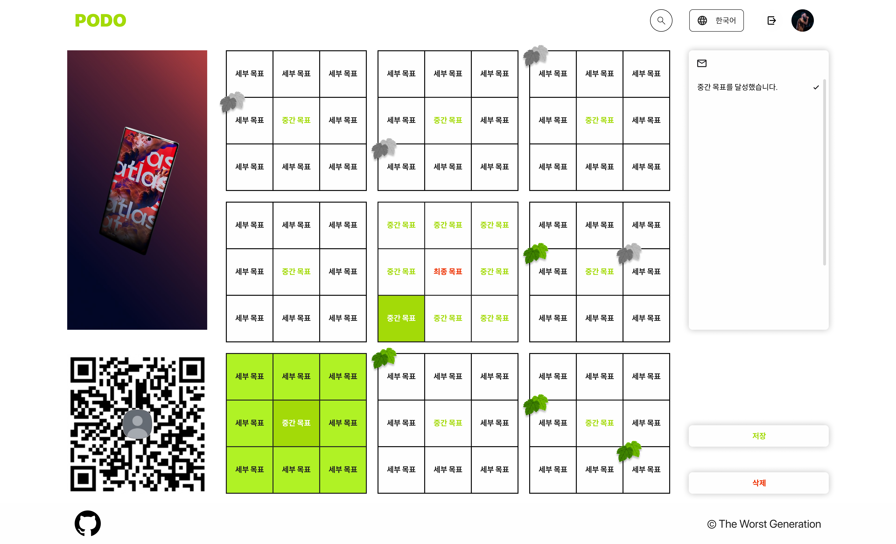
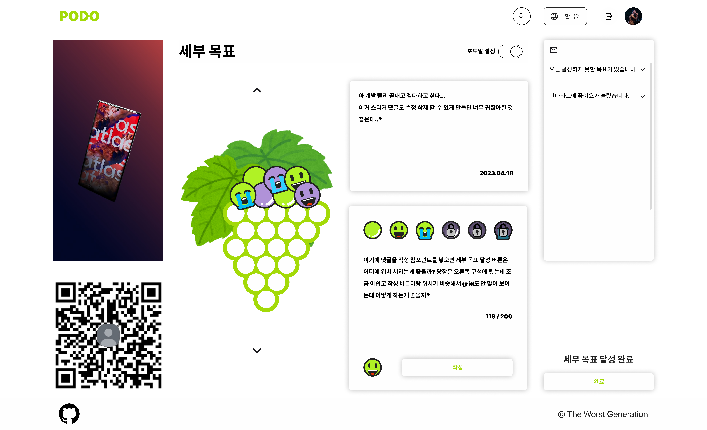
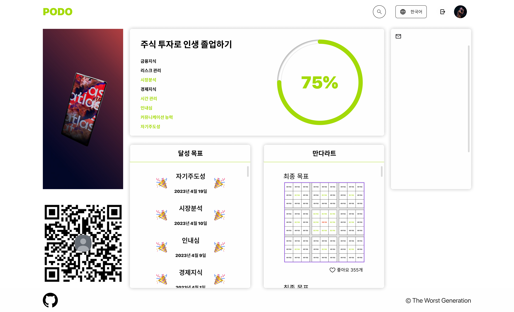
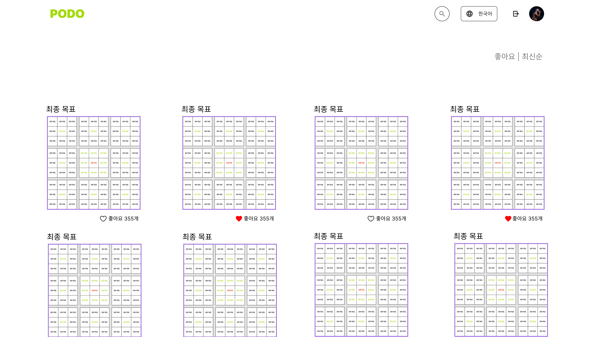
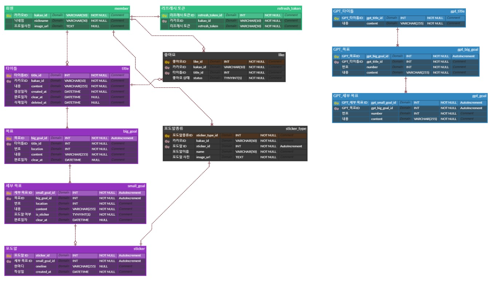
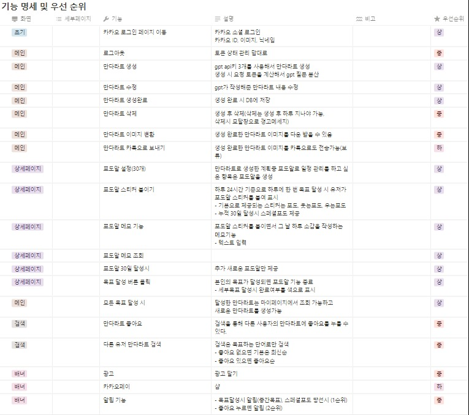
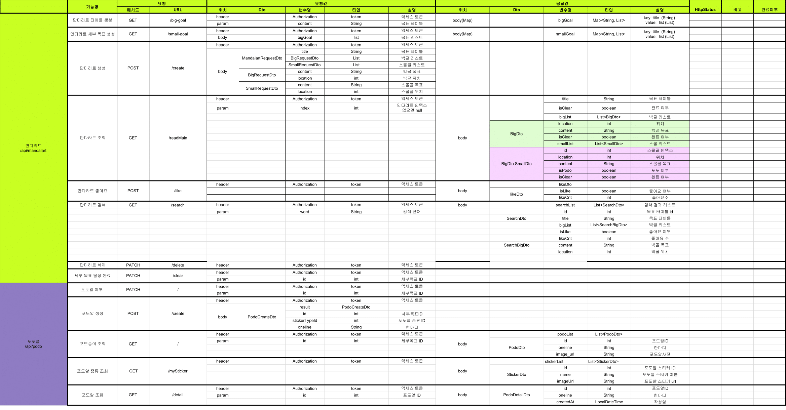
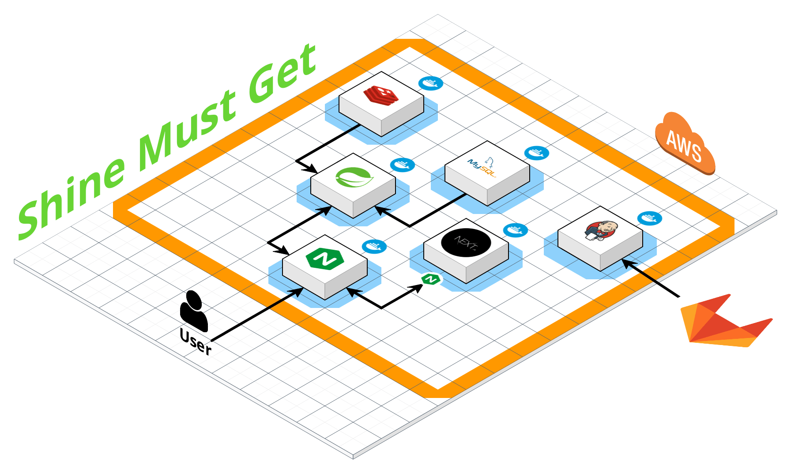

<h1>Shine Must Get</h1>

### 목차 

[Figma Design](#figma-design)

[ERD](#erd)

[명세서](#명세서)

[System Architecture](#system-architecture)

[Porting manual](#porting-manual)

## Figma Design

### Landing Page

### Main Page

### Detail Page

### Profile Page

### Search Page

## ERD

## 명세서

### 요구사항 명세서

### API 명세서

## System Architecture

## [Porting Manual](./PORTING_MANUAL.md)

1. 프로젝트 사용 도구
2. 개발 환경
3. 외부 서비스
4. .gitignore 처리한 파일
5. 배포관련 설정
6. 빌드
