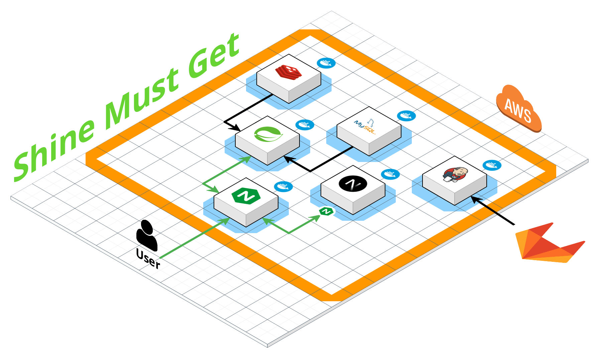

<h1>Shine Must Get</h1>

<section id="context">
    <h2>목차</h2>
    <ol style="padding:1rem">
        <li><a href="#figma" style="text-decoration: none; color: black">Figma Design</a></li>
        <li><a href="#erd" style="text-decoration: none; color: black">ERD</a></li>
        <li><a href="#specification" style="text-decoration: none; color: black">명세서</a></li>
        <li><a href="#architecture" style="text-decoration: none; color: black">System Architecture</a></li>
        <li><a href="#porting" style="text-decoration: none; color: black">Porting manual</a></li>
    </ol>
</section>

<section id="figma">
    <h1>Figma Design</h1>
    <h2>Landing Page</h2>
    
    <h2>Main Page</h2>
    
    <h2>Detail Page</h2>
    
    <h2>Profile Page</h2>
    
    <h2>Search Page</h2>
    
</section>

<section id="erd">
    <h1>ERD</h1>
    
</section>

<section id="specification">
    <h1>명세서</h1>
    <h2>요구사항 명세서</h2>
    
    <h2>API 명세서</h2>
    
</section>

<section id="architecture">
    <h1>System Architecture</h1>
    
</section>

<section id="porting">
    <h1>Porting Manual</h1>
    <ol style="padding:1rem">
        <li>프로젝트 사용 도구</li>
        <li>개발환경</li>
        <li>외부 서비스</li>
        <li>.gitignore 처리한 파일</li>
        <li>배포관련 설정</li>
        <li>빌드</li>
    </ol>
</section>
